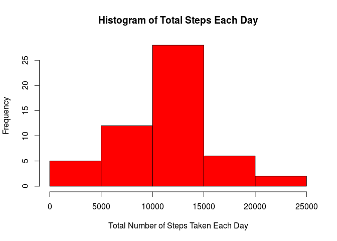
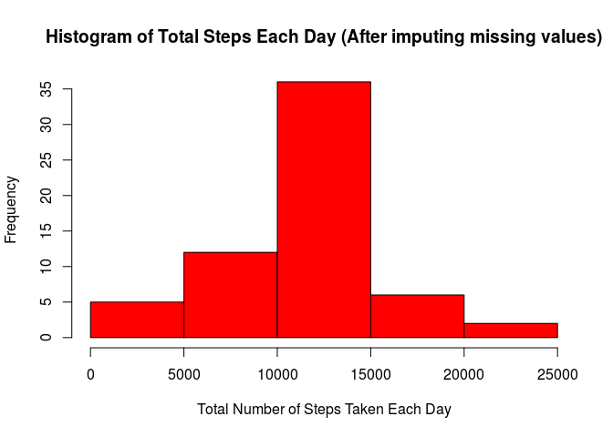
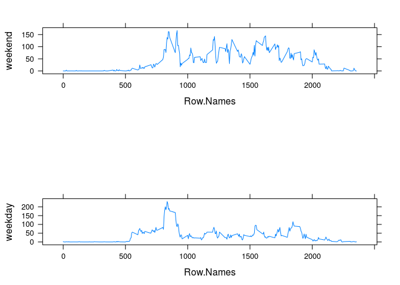

# Reproducible Research: Peer Assessment 1


## Loading and preprocessing the data

```r
library(data.table)
data <- fread("./activity.csv", na.strings = c('NA'), header=TRUE)
na.removed <- data[complete.cases(data),]
```
## What is mean total number of steps taken per day?

```r
sumStepsByDate <- tapply(na.removed$steps, na.removed$date, FUN=sum)
hist(sumStepsByDate, col="red", main="Histogram of Total Steps Each Day", xlab="Total Number of Steps Taken Each Day")
```

 

```r
meanSteps <- format(mean(sumStepsByDate), scientific=FALSE)
medianSteps <- median(sumStepsByDate)
```
The mean number of steps taken per day is 10765.85.  
The median number of steps taken per day is 10765.

## What is the average daily activity pattern?

```r
avgByTimePeriod <- as.data.frame(tapply(na.removed$steps, na.removed$interval, FUN=mean))
avgByTimePeriod <- cbind(Row.Names = rownames(avgByTimePeriod), avgByTimePeriod)
setnames(avgByTimePeriod, c("interval","mean"))
plot(rownames(avgByTimePeriod), 
     avgByTimePeriod$mean, 
     type="l", 
     xaxt="n",
     main="Average Number of Steps per 5 Minute Interval", 
     xlab="Interval",
     ylab="Average Number of Steps")
axis(1, at = seq(0, 2400, by = 100), las=2)
```

 

```r
maxInterval <- rownames(which(avgByTimePeriod$mean == max(avgByTimePeriod$mean), arr.ind=TRUE)) 
maxAvgSteps <- max(avgByTimePeriod$mean)
```
The 5 minute interval at 835 contains the maximum average number of steps across all the days in the dataset with a value of 206.1698113.

## Imputing missing values

```r
numMissingSteps <- sum(is.na(data$steps))
```
There are 2305 rows missing the number of steps.

## What is mean total number of steps taken per day with missing steps set to the average for the time period?

```r
#Need to convert to character for merge.
tempData <- data[,interval:=as.character(interval)]
addedTimePeriodAvg <- merge(tempData,avgByTimePeriod, by="interval")

#replace the step column with the avg if the value is na.
replacedNA <- as.data.frame(replace(addedTimePeriodAvg$steps, is.na(addedTimePeriodAvg$steps), addedTimePeriodAvg$mean[is.na(addedTimePeriodAvg$steps)]))
replacedNA <- cbind(addedTimePeriodAvg, replacedNA)
setnames(replacedNA, c("interval","steps", "date", "mean", "replaceNA"))

replacedNA <-subset(replacedNA, select = c(replaceNA, date, interval))
setnames(replacedNA, c("steps", "date", "interval"))

sumByDateImputing <- tapply(replacedNA$steps, replacedNA$date, FUN=sum)
hist(sumByDateImputing, col="red", main="Histogram of Total Steps Each Day (After imputing missing values)", xlab="Total Number of Steps Taken Each Day")
```

 

```r
meanStepsImputing <- format(mean(sumByDateImputing), scientific=FALSE)
medianStepsImputing <- format(median(sumByDateImputing), scientific=FALSE)
```

The mean number of steps taken per day (after imputing) is 10765.89.  
The median number of steps taken per day (after imputing) is 10765.89.

These values are the same as the mean value when NAs have been removed.  Since the missing NAs were for entire days, adding the mean of the interval for each interval/day combination maintained did not shift the mean value.  The mean was effectively added 8 times and did not have an effect on the new mean.  The median was shifted closer to the mean (actually exactly) since more entries were added at the mean.

## Are there differences in activity patterns between weekdays and weekends?

```r
replacedNA$date <- as.Date(replacedNA$date)
weekdays1 <- c('Monday', 'Tuesday', 'Wednesday', 'Thursday', 'Friday')
replacedNA$wDay <- factor((weekdays(replacedNA$date) %in% weekdays1), 
                   levels=c(FALSE, TRUE), labels=c('weekend', 'weekday') )
meanByWDay <- tapply(replacedNA$steps, list(replacedNA$interval, replacedNA$wDay) , mean) 
meanByWDay.df <- data.frame(meanByWDay)
meanByWDay.df <- cbind(Row.Names = as.numeric(rownames(meanByWDay.df)), meanByWDay.df)
neworder <- meanByWDay.df[order(meanByWDay.df$Row.Names),]

par(mfrow = c(2,1))

plot(rownames(neworder), 
     neworder$weekend, 
     type="l", 
     xaxt="n",
     main="Average Number of Steps per 5 Minute Interval for Weekends", 
     xlab="Interval",
     ylab="# Steps (Weekend)")
axis(1, at = seq(0, 2400, by = 100), las=2)

plot(rownames(neworder), 
     neworder$weekday, 
     type="l", 
     xaxt="n",
     main="Average Number of Steps per 5 Minute Interval for Weekdays", 
     xlab="Interval",
     ylab="# Steps (Weekday)")
axis(1, at = seq(0, 2400, by = 100), las=2)
```

 

The plots indicate that there is a difference in the activity patterns between the weekend and weekdays.  The max activity level is lower on weekends than weekdays but activity is higher for longer periods of file on the weekend than the weekday.
